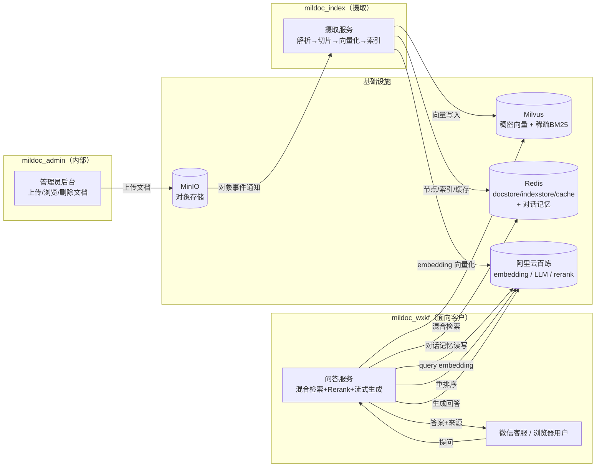
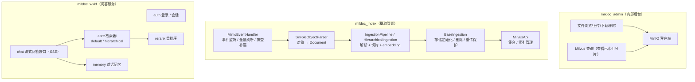

# mildoc_llamaindex

基于 [LlamaIndex](https://docs.llamaindex.ai/) 的企业文档 RAG（检索增强生成）问答系统。
管理员把企业文档上传到对象存储后，系统自动解析、切片、向量化并建立索引；最终客户（微信客服 / 浏览器）提问时，
从已索引的文档中做**混合检索 + 重排序 + LLM 流式生成**，返回带引用来源的答案。

---

## 一、项目功能

| 能力 | 说明 |
|---|---|
| 文档摄取 | 监听对象存储事件，自动把文档解析为节点、切片、向量化、写入向量库与文档库 |
| 多格式解析 | 支持 Markdown / 文本 / Office / PDF 等，借助 `SimpleObjectParser` 统一抽取 |
| 混合检索 | **稠密向量（语义）** + **稀疏 BM25（关键词）** 双路召回，互补长短板 |
| 层次化解析 | 可选 `hierarchical` 模式，用 `HierarchicalNodeParser` 保留文档标题层级 |
| 重排序 | 调用百炼 Rerank 服务对召回分片精排，提升答案相关性 |
| 流式问答 | 基于 SSE 流式返回答案，并附带引用来源（去重） |
| 对话记忆 | 每轮对话自动写入记忆服务（Redis + MySQL），支持多轮上下文 |
| 增量更新 | 文档新增 / 删除事件实时触发索引更新，无需全量重建 |
| 索引调优 | 通过 `.env` 配置 `index_type / nlist / metric_type / nprobe` |

---

## 二、技术架构

整体由三个独立服务 + 一套基础设施组成：

- **mildoc_admin**（内部后台）：管理员上传 / 浏览 / 删除 MinIO 中的文档，并查看已索引分片。
- **mildoc_index**（摄取管线）：消费对象存储事件，完成解析 → 切片 → 向量化 → 落库。
- **mildoc_wxkf**（问答服务，面向客户）：接收用户问题，做混合检索 → Rerank → LLM 流式回答。
- **基础设施**：MinIO（对象存储）、Milvus（向量库，稠密 + 稀疏 BM25）、Redis（docstore / index store / ingestion cache / 对话记忆）、阿里云百炼（embedding / LLM / rerank API）。

### 关键数据流

1. 管理员在 **mildoc_admin** 上传文档 → 写入 **MinIO**（按 `NODE_PARSER_MODE` 区分 `default` / `hierarchical` 两个桶）。
2. **mildoc_index** 监听 MinIO 事件（`ObjectCreated` / `ObjectRemoved`），调用 `SimpleObjectParser` 解析为 `Document`。
3. 摄取管线对文档切片 + 调百炼 **embedding** 生成向量，写入 **Milvus**（稠密 + 稀疏 BM25 双索引）与 **Redis**（docstore / index store / ingestion cache）。
4. 客户在 **mildoc_wxkf** 提问 → query 经 embedding 后做**混合检索** → **Rerank** 精排 → **LLM** 流式合成答案 → 返回用户（含引用来源）。
5. 每轮对话由记忆服务写入 **Redis + MySQL**，供多轮上下文使用(过期时间为滑动续期)。

---

## 三、功能模块

### 模块职责一览

| 子项目 | 模块 | 职责 |
|---|---|---|
| mildoc_admin | `admin_app.py` | 登录鉴权、文件浏览/上传/下载/删除、查看 Milvus 分片 |
| mildoc_index | `minio_event_handler.py` | 监听 MinIO 事件、全量刷新、线程池并发处理、按模式选桶/集合 |
| mildoc_index | `parse/simple_object_parser.py` | 把 MinIO 对象解析为 LlamaIndex `Document` |
| mildoc_index | `ingestion/*` | 摄取基类（存储初始化、删除、重传保护）+ default / hierarchical 两种管道 |
| mildoc_index | `milvus/milvus_api.py` | 集合创建、索引管理、flush 等 |
| mildoc_wxkf | `auth/` | 登录、会话管理 |
| mildoc_wxkf | `chat/routes.py` | 流式问答接口（SSE），驱动 RAG 链路 |
| mildoc_wxkf | `core/*` | default / hierarchical 检索器、prompt、Rerank 接入 |
| mildoc_wxkf | `memory/` | 对话记忆（Redis + MySQL）读写 |

---

## 四、项目亮点

1. **稠密 + 稀疏混合检索**：语义向量召回解决「换个说法也能懂」，BM25 关键词召回解决「专有名词 / 精确匹配」，两路 `AnnSearchRequest` 经 `RRFRanker` 融合。
2. **层次化解析可选**：`NODE_PARSER_MODE=hierarchical` 时启用 `HierarchicalNodeParser`，保留「文档 → 章节 → 段落」层级，利于长文档定位。两种模式各自独立桶 / 集合，互不干扰。
3. **重传 / 覆盖保护**：文档重传时先删旧数据再写新数据，且删除逻辑用 `delete_ref_doc` **级联清理父/子节点**，避免残留孤儿节点（仅 `delete_document` 会漏删子节点）。
4. **增量实时摄取**：监听 MinIO 事件触发单对象解析，无需停服全量重建；并配有 `full-refresh` / `backfill` 模式应对初始化与补漏。
5. **可配置索引调优**：`index_type / nlist / metric_type / nprobe` 均可通过 `.env` 配置（建索引类参数改后需删集合重摄取，查询类参数即时生效）。
6. **流式体验 + 可追溯**：SSE 流式生成，答案附带按 `file_path` 去重的引用来源。
7. **多轮对话记忆**：记忆服务同时落 Redis（快）与 MySQL（持久），支撑上下文连续。

---

## 五、高并发瓶颈分析

> mildoc_admin 与 mildoc_index 主要供内部管理员使用、流量低，瓶颈不敏感；
> **下面重点分析面向客户的 mildoc_wxkf**。

客户每提一个问题，RAG 链路会产生多次外部调用：`CondenseQuestionChatEngine` 先做一轮**问题压缩（LLM）**，随后**query embedding** → **Milvus 混合检索** → **Rerank（百炼）** → **LLM 流式合成**。
即单次问答最多涉及 3~4 次外部 API 调用（百炼的 embedding / LLM / rerank）。

### 瓶颈点

| # | 瓶颈 | 原因 | 解决思路 |
|---|---|---|---|
| 1 | **百炼 API 限流（首号瓶颈）** | embedding / LLM / rerank 全部走百炼，有 QPS / 并发上限；单问题多次调用叠加后极易触顶 | 申请提额；引入**语义缓存**（相似问题直接命中答案或检索结果）；非多轮场景可跳过问题压缩；异步化 + 队列削峰 |
| 2 | **Flask 单进程** | `app.run(processes=1, threaded=True)`，且 SSE 流式响应会**长期占用线程**直到生成完成，高并发下线程池耗尽 → 排队 / 超时 | 用 **gunicorn / uvicorn 多 worker** 部署；长连接考虑 WebSocket；生成放入后台任务 + 推送 |
| 3 | **Milvus 检索性能** | 默认 `index_type=FLAT` 为暴力全量扫描 O(N)，数据量增大后单查变慢、吃 CPU | 改为 **IVF_FLAT / IVF_SQ8** 等索引并调 `nlist / nprobe`；Milvus 横向扩容（分片 / 副本）；查询侧加缓存 |
| 4 | **无检索结果缓存** | 每个问题都重新 embedding + 查 Milvus + rerank，重复问题也走全链路 | 加**语义缓存**：对 query embedding 做相似度命中，直接复用检索结果 / 答案 |
| 5 | **记忆存储（MySQL / Redis）** | 每轮对话写入记忆，高并发下 DB 连接池可能成为瓶颈 | 连接池调优、批量 / 异步落库 |
| 6 | **共享客户端连接池** | embedding / LLM / rerank 的 HTTP 客户端若无连接池上限与并发信号量，高并发下会被打满 | 设置连接池上限 + 信号量限流；对外部 API 做统一限流与降级 |

---

## 六、后续优化点

- **语义 / 答案缓存**：相同 / 相似问题直接命中，显著削减百炼调用与 Milvus 压力。
- **多 worker 部署**：用 gunicorn 多进程替换单进程 Flask，消除 SSE 长连接对单进程的占用。
- **索引优化**：FLAT → IVF 系列（+ 量化），大数据量下用 GPU 索引进一步提速。
- **Rerank 本地化**：把远程 Rerank 调用替换为本地轻量重排模型，减少一次外部往返与限流风险。
- **异步化**：摄取与问答引入了队列 / Celery，把重活（embedding、生成）异步化，前端轮询或推送。
- **限流与降级**：百炼限流时返回兜底答案 / 引导话术，避免链路雪崩。
- **监控与指标**：采集检索耗时、命中率、外部 API 限流次数、流式首字延迟，驱动进一步调优。
- **摄取并行**：通过 `IngestionPipeline.run(num_workers=N)` 把文档切片后的 embedding 并行起来（注意百炼 embedding 单请求上限 10 条，`embed_batch_size` 不可超过此值）。
- **多租户 / 集合隔离**：按业务线隔离 Milvus 集合与 Redis 命名空间。
