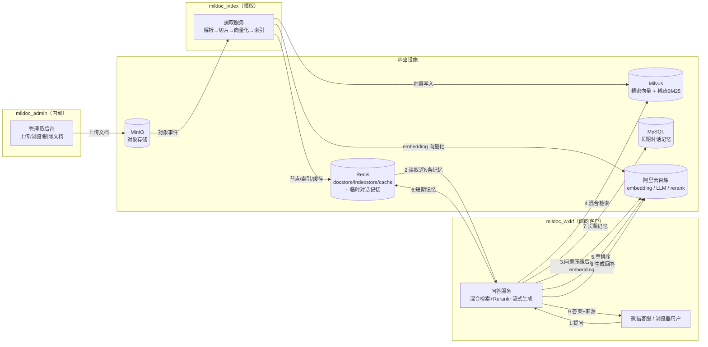
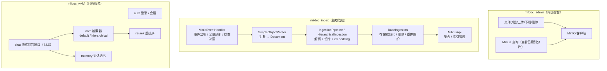
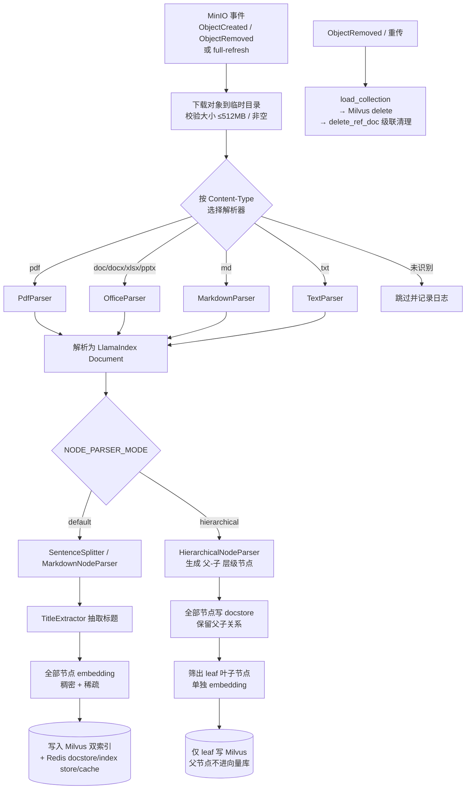
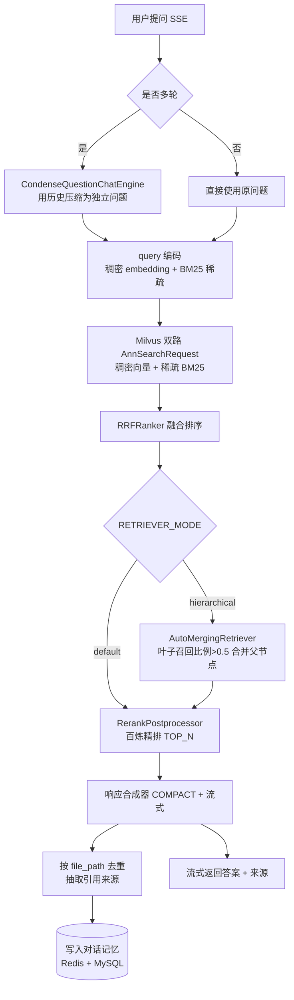
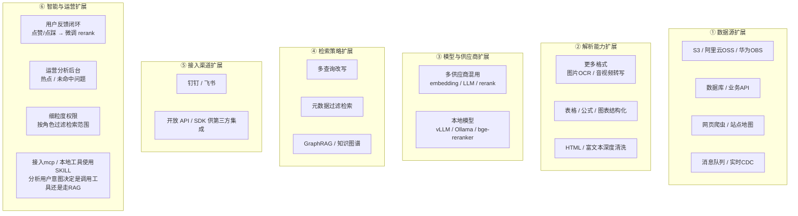

# mildoc_llamaindex

基于 [LlamaIndex](https://docs.llamaindex.ai/) 的企业文档 RAG（检索增强生成）问答系统。
管理员把企业文档上传到对象存储后，系统自动解析、切片、向量化并建立索引；最终客户（微信客服 / 浏览器）提问时，
从已索引的文档中做**混合检索 + 重排序 + LLM 流式生成**，返回带引用来源的答案。

---

## 一、项目功能

| 能力 | 说明 |
|---|---|
| 文档摄取 | 监听对象存储事件，自动把文档解析为节点、切片、向量化、写入向量库与文档库 |
| 多格式解析 | 支持 Markdown / 文本 / Office / PDF 等，借助 `SimpleObjectParser` 统一抽取 |
| 混合检索 | **稠密向量（语义）** + **稀疏 BM25（关键词）** 双路召回，互补长短板 |
| 层次化解析 | 可选 `hierarchical` 模式，用 `HierarchicalNodeParser` 保留文档标题层级 |
| 重排序 | 调用百炼 Rerank 服务对召回分片精排，提升答案相关性 |
| 流式问答 | 基于 SSE 流式返回答案，并附带引用来源（去重） |
| 对话记忆 | 每轮对话自动写入记忆服务（Redis + MySQL），支持多轮上下文 |
| 增量更新 | 文档新增 / 删除事件实时触发索引更新，无需全量重建 |
| 索引调优 | 通过 `.env` 配置 `index_type / nlist / metric_type / nprobe` |

---

## 二、系统支持的文档格式

系统通过 `mildoc_index` 的 `SimpleObjectParser` 统一解析，按对象存储返回的 `Content-Type` 自动分派到对应解析器。当前支持以下 7 种格式：

| 格式 | 解析入口 | 说明 |
|---|---|---|
| `.pdf` | `PdfParser` | 提取正文文本；复杂排版 / 扫描件可能丢失版式 |
| `.doc` / `.docx` | `OfficeParser` | Word 文档，转文本后走通用切片 |
| `.xlsx` | `OfficeParser` | Excel，按工作表 / 单元格抽取为文本 |
| `.pptx` | `OfficeParser` | PowerPoint，按幻灯片抽取为文本 |
| `.md` | `MarkdownParser` | 保留 Markdown 标题层级后再切片 |
| `.txt` | `TextParser` | 纯文本，直接切片 |

> 解析入口对单文件大小有限制（≤ 512MB），空文件与超大文件会被跳过；未被识别的 `Content-Type` 不会报错，仅记录日志并跳过，保证摄取管线稳定。

---

## 三、技术架构

整体由三个独立服务 + 一套基础设施组成：

- **mildoc_admin**（内部后台）：管理员上传 / 浏览 / 删除 MinIO 中的文档，并查看已索引分片。
- **mildoc_index**（摄取管线）：消费对象存储事件，完成解析 → 切片 → 向量化 → 落库。
- **mildoc_wxkf**（问答服务，面向客户）：接收用户问题，做混合检索 → Rerank → LLM 流式回答。
- **基础设施**：MinIO（对象存储）、Milvus（向量库，稠密 + 稀疏 BM25）、Redis（docstore / index store / ingestion cache / 对话记忆）、阿里云百炼（embedding / LLM / rerank API）。

### 关键数据流

1. 管理员在 **mildoc_admin** 上传文档 → 写入 **MinIO**（按 `NODE_PARSER_MODE` 区分 `default` / `hierarchical` 两个桶）。
2. **mildoc_index** 监听 MinIO 事件（`ObjectCreated` / `ObjectRemoved`），调用 `SimpleObjectParser` 解析为 `Document`。
3. 摄取管线对文档切片 + 调百炼 **embedding** 生成向量，写入 **Milvus**（稠密 + 稀疏 BM25 双索引）与 **Redis**（docstore / index store / ingestion cache）。
4. 客户在 **mildoc_wxkf** 提问 → query 经 embedding 后做**混合检索** → **Rerank** 精排 → **LLM** 流式合成答案 → 返回用户（含引用来源）。
5. 每轮对话由记忆服务写入 **Redis + MySQL**，供多轮上下文使用(过期时间为滑动续期)。

---

## 四、功能模块

### 模块职责一览

| 子项目 | 模块 | 职责 |
|---|---|---|
| mildoc_admin | `admin_app.py` | 登录鉴权、文件浏览/上传/下载/删除、查看 Milvus 分片 |
| mildoc_index | `minio_event_handler.py` | 监听 MinIO 事件、全量刷新、线程池并发处理、按模式选桶/集合 |
| mildoc_index | `parse/simple_object_parser.py` | 把 MinIO 对象解析为 LlamaIndex `Document` |
| mildoc_index | `ingestion/*` | 摄取基类（存储初始化、删除、重传保护）+ default / hierarchical 两种管道 |
| mildoc_index | `milvus/milvus_api.py` | 集合创建、索引管理、flush 等 |
| mildoc_wxkf | `auth/` | 登录、会话管理 |
| mildoc_wxkf | `chat/routes.py` | 流式问答接口（SSE），驱动 RAG 链路 |
| mildoc_wxkf | `core/*` | default / hierarchical 检索器、prompt、Rerank 接入 |
| mildoc_wxkf | `memory/` | 对话记忆（Redis + MySQL）读写 |

---

## 五、文档摄取详细过程

文档摄取由 `mildoc_index` 完成，整体为「事件触发 → 解析 → 切片 → 向量化 → 落库」。系统支持两种切片模式：**默认摄取（default）** 与 **层次结构摄取（hierarchical）**，二者通过 `.env` 的 `NODE_PARSER_MODE` 切换，且各自使用独立的 Milvus 集合与 Redis 命名空间，互不干扰。

### 5.1 默认摄取（default）

- 文本类（`.txt`）→ `SentenceSplitter` 按 `chunk_size` 切块、`chunk_overlap` 重叠；
- Markdown 类（`.md`）→ 先 `MarkdownNodeParser` 保留标题层级，再用 `SentenceSplitter` 按段落细化；
- 两种都接 `TitleExtractor` 抽取标题，然后**全部节点一次性 embedding**，写入 Milvus（稠密 + 稀疏 BM25 双索引）与 Redis docstore / index store / ingestion cache。

### 5.2 层次结构摄取（hierarchical）

使用 `HierarchicalNodeParser` 把文档切成「父节点（大块）→ 子节点（小块）」层级：

- 文本类：按配置的 `HIERARCHICAL_CHUNK_SIZES` 逐层用 `SentenceSplitter` 切出「大块 → 小块」父子层级；
- Markdown 类：顶层用 `MarkdownNodeParser` 保留标题层级，更深层再用 `SentenceSplitter` 继续切分；
- **关键优化**：同一次解析产出的「父 + 子」节点只写 docstore（保留父子关系供检索合并），**仅叶子节点**单独 embedding 后写入 Milvus——父节点不进向量库，省空间也避免稀释精度。

### 5.3 删除 / 重传保护

1. 文档删除或重传时，先 `load_collection` 确保集合在内存，再 `delete`（Milvus 按 doc_id 删向量）→ `delete_ref_doc` **级联清理** docstore 中父 / 子节点（仅 `delete_document` 会漏删子节点，导致孤儿节点）。
2. 重复上传文档时，先通过doc_id检测doc_store是否已经存在，如果存在则比较hash值是否相等，如果不相等则说明文档内容有变化，先删除(避免残留)已有文档(删除流程)，如果hash值相等则说明文件重复上传，直接交给管道(管道会跳过该文档)。
3. 为什么hash值不同的时候要先删除文档？因为如果直接交给管道，管道不会自动删除已有文档，而是直接上传，这样可能会造成孤儿节点。

### 5.4 摄取流程图

---

## 六、检索实现详细过程

检索由 `mildoc_wxkf` 完成，整体为「问题压缩（多轮）→ 混合召回 → 融合 → 重排 → 流式合成 → 抽取来源 → 记忆落库」。系统支持两种检索模式，与摄取侧模式一一对应：

### 6.1 默认混合检索（default）

- 多轮对话时，`CondenseQuestionChatEngine` 先用历史把追问**压缩成独立问题**（如果想要保留原样的多轮对话，可以使用ContextChatEngine）；
- query 同时做**稠密 embedding** 与 **BM25 稀疏** 编码，向 Milvus 发两路 `AnnSearchRequest`；
- 两路结果用 **`RRFRanker`** 按 reciprocal rank 融合，互补语义召回与关键词精确匹配；
- `RerankPostprocessor` 调用百炼 **Rerank** 对融合结果精排取 `TOP_N`；
- `get_response_synthesizer`（COMPACT 模式 + 流式）基于精排分片合成答案，并按 `file_path` 去重抽取**引用来源**。

### 6.2 层次结构检索（hierarchical）

在默认混合检索之上再套 **`AutoMergingRetriever`**：混合检索先召回若干**叶子节点**，若同一父节点的叶子召回比例超过阈值（默认 0.5），自动**合并为父节点**的完整文本，用更连贯的上下文合成答案，提升长文档问答精度。该模式依赖 docstore 中的父子关系，故检索侧命名空间必须与 hierarchical 摄取侧完全一致。

### 6.3 检索流程图

---

## 七、项目亮点

1. **稠密 + 稀疏混合检索**：语义向量召回解决「换个说法也能懂」，BM25 关键词召回解决「专有名词 / 精确匹配」，两路 `AnnSearchRequest` 经 `RRFRanker` 融合。
2. **层次化解析可选**：`NODE_PARSER_MODE=hierarchical` 时启用 `HierarchicalNodeParser`，保留「文档 → 章节 → 段落」层级，利于长文档定位。两种模式各自独立桶 / 集合，互不干扰。
3. **重传 / 覆盖保护**：文档重传时如果内容有变化先删旧数据再写新数据，且删除逻辑用 `delete_ref_doc` **级联清理父/子节点**，避免残留孤儿节点（仅 `delete_document` 会漏删子节点）。
4. **增量实时摄取**：监听 MinIO 事件触发单对象解析，无需停服全量重建；并配有 `full-refresh` / `backfill` 模式应对初始化与补漏。
5. **可配置索引调优**：`index_type / nlist / metric_type / nprobe` 均可通过 `.env` 配置（建索引类参数改后需删集合重摄取，查询类参数即时生效）。
6. **多轮对话记忆**：记忆服务同时落 Redis（快）与 MySQL（持久），支撑上下文连续。

---

## 八、高并发瓶颈分析

> mildoc_admin 与 mildoc_index 主要供内部管理员使用、流量低，瓶颈不敏感；
> **下面重点分析面向客户的 mildoc_wxkf**。

客户每提一个问题，RAG 链路会产生多次外部调用：`CondenseQuestionChatEngine` 先做一轮**问题压缩（LLM）**，随后**query embedding** → **Milvus 混合检索** → **Rerank（百炼）** → **LLM 流式合成**。
即单次问答最多涉及 3~4 次外部 API 调用（百炼的 embedding / LLM / rerank）。

### 瓶颈点

| # | 瓶颈 | 原因 | 解决思路                                                             |
|---|---|---|------------------------------------------------------------------|
| 1 | **百炼 API 限流（首号瓶颈）** | embedding / LLM / rerank 全部走百炼，有 QPS / 并发上限；单问题多次调用叠加后极易触顶 | 申请提额；引入**语义缓存**（相似问题直接命中答案或检索结果）；非多轮场景可跳过问题压缩；异步化 + 队列削峰         |
| 2 | **流式响应长期占用线程** | SSE 流式响应会**长期占用线程**直到生成完成，高并发下线程池耗尽 → 排队 / 超时 | 用 **gunicorn / uvicorn 多 worker** 部署；长连接考虑 WebSocket；生成放入后台任务 + 推送 |
| 3 | **Milvus 检索性能** | index_type和nlist在摄取文档之后无法再改动，数据量超过预期导致检索变慢 | 调整nprobe(调大后可能会影响到搜索精度)；Milvus 横向扩容（分片 / 副本）；查询侧加缓存              |
| 4 | **无检索结果缓存** | 每个问题都重新 embedding + 查 Milvus + rerank，重复问题也走全链路 | 加**语义缓存**：对 query embedding 做相似度命中，直接复用检索结果 / 答案                 |
| 5 | **记忆存储（MySQL / Redis）** | 每轮对话写入记忆，高并发下 DB 连接池可能成为瓶颈 | 批量 / 异步落库，通过队列削峰                                                 |
| 6 | **共享客户端连接池** | embedding / LLM / rerank 的 HTTP 客户端若无连接池上限与并发信号量，高并发下会被打满 | 设置连接池上限 + 信号量限流；对外部 API 做统一限流与降级                                 |

---

## 九、后续优化点
- **查询重写 / 查询转换**：评估的时候发现当问题问的比较笼统(很宽泛)、一下提出好几个问题的时候检索效果不是太好，可以考虑引入查询重写/转换；或者也可以引导用户更清晰的表达问题。
- **引入对表格友好的解析器**：评估的时候发现当标准答案里包含的表格很多时，召回率偏低，可以考虑引入（比如MarkdownElementNodeParser）。
- **使用更稳定的文档解析工具**：在将pdf/office文档转为md文档的时候，现有逻辑（pdf使用pymupdf4llm，office文档使用libre+pymupdf4llm）有时候对标题识别不准(有时候会把正文内容识别为标题)，导致正文内容被截断，影响召回，可以考虑使用更可靠的云服务。
- **语义 / 答案缓存**：相同 / 相似问题直接命中，显著削减百炼调用与 Milvus 压力。
- **Rerank 本地化**：如果需要可以考虑把远程 Rerank 调用替换为本地轻量重排模型，减少一次外部往返与限流风险。
- **摄取并行**：通过 `IngestionPipeline.run(num_workers=N)` 把文档切片后的 embedding 并行起来（注意百炼 embedding 单请求上限（我的账号目前是 10 条），`embed_batch_size` 不可超过此值）。
- **现在对多图片的文档检索效果比较差**：可以考虑使用第三方工具(比如MinerU)结合OCR实现对图片的精准处理（也可以将图片上传到云服务后，想办法在检索结果里直接保留图片，本项目试过这种方法，暂时没成功，但是感觉还可以继续探讨）

---

## 十、项目扩展点

下列方向基于现有架构（LlamaIndex + 百炼 + Milvus + Redis + MinIO）做了接口预留或仅需在某一层替换 / 新增组件即可落地，可作为下一步演进路线参考。

### 扩展方向一览

| # | 方向             | 现状 / 切入点                | 扩展方式                                                                                 |
|---|----------------|-------------------------|--------------------------------------------------------------------------------------|
| 1 | **数据源接入**      | 仅 MinIO 事件触发            | 新增数据源适配器即可（如 S3/OSS 事件、数据库 CDC、网页爬虫），复用现有 `SimpleObjectParser → IngestionPipeline` 链路 |
| 2 | **解析 / 文件格式**  | 统一 `SimpleObjectParser` | 扩展解析器支持 PPT/Excel(现阶段的处理比较粗暴)/图片 OCR/音视频转写；增加表格、公式、图表的结构化抽取                          |
| 3 | **模型与供应商**     | 全部走百炼兼容端点               | 抽象 `BaseEmbedding / BaseLLM / 重排` 接口，可混用不同厂商，或切换本地模型（vLLM、Ollama、bge-reranker）降本提速   |
| 4 | **检索策略升级**     | 稠密 + 稀疏 + Rerank        | 引入 GraphRAG；多查询改写；增加基于元数据的过滤检索                                                       |
| 5 | **接入渠道**       | 微信客服 / 浏览器              | 复用 `chat` 层 RAG 链路，新增 钉钉 / 飞书 / Slack 等渠道适配；开放 API / SDK 供第三方集成                      |
| 6 | **反馈闭环与微调**    | 仅记录对话记忆                 | 收集用户对答案的点赞 / 点踩，反哺重排模型微调或检索权重调优                                                      |
| 7 | **评估体系**       | 无自动评估                   | 接入 Ragas 等框架，对召回率、答案相关性、忠实度做自动化评测，量化迭代效果                                             |
| 8 | **运营分析后台**     | 仅管理文档                   | 统计热点问题、未命中 / 低置信度问题，指导文档补充与 Prompt 优化                                                |
| 9 | **细粒度权限 / 租户** | 集合级隔离                   | 在检索侧按用户角色 / 组织过滤 `file_path` 等元数据，实现「不同人看到不同文档范围」的权限隔离                               |
| 10 | **智能体方向扩展**    | 用户提问直接检索                | 引入mcp/skill，识别用户意图决定是调工具还是检索或者闲聊                                                     |

> 上述扩展大多**不破坏现有分层**：数据源层只需新增适配器、模型层只需替换接口实现、检索层只需叠加新策略、渠道层只需复用 `chat` 的 RAG 链路，因而整体演进成本可控。
