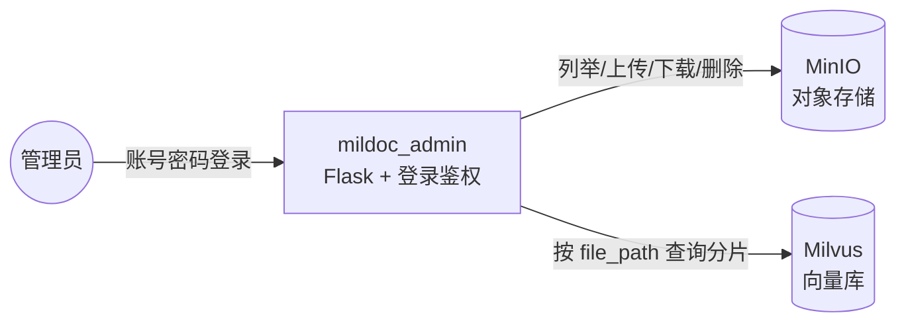

# mildoc_admin · 管理后台

内部管理员使用的 Web 后台（Flask），负责浏览 / 上传 / 下载 / 删除对象存储中的文档，并查看某篇文档在 Milvus 中已索引的分片内容。该模块主要供内部使用、流量低，对高并发不敏感。

## 技术架构



- 桶与集合按 `NODE_PARSER_MODE` 选择：`hierarchical` → `MINIO_BUCKET_HIER` / `MILVUS_COLLECTION_HIER`；默认 → `MINIO_BUCKET` / `MILVUS_COLLECTION`。
- MinIO 客户端设了连接 / 读取超时（5s / 15s），避免 MinIO 不可达时页面长时间转圈。
- Milvus 通过 `MilvusClient` 直接查询，按 `file_path == "桶名/路径"` 过滤出该文档的所有分片。

## 主要接口

| 路由 | 方法 | 说明 |
|---|---|---|
| `/` | GET | 重定向到登录页或文件浏览页 |
| `/login` `/logout` | GET/POST | 账号密码登录（`ADMIN_USERNAME` / `ADMIN_PASSWORD`），基于 Flask `session` |
| `/files` | GET | 文件浏览页面 |
| `/api/files` | GET | 列举某路径下的文件 / 文件夹（递归一层） |
| `/file/<path>` | GET | 文件详情页面 |
| `/api/file/<path>` | GET | 文件元信息 + Milvus 中该文档已索引的分片列表（含每段文本与长度） |
| `/api/file/<path>/download` | GET | 从 MinIO 下载文件（中文名做 URL 编码） |
| `/api/file/<path>/delete` | DELETE | 删除 MinIO 中的文件 |
| `/api/create-directory` | POST | 创建目录（上传一个 0 字节目录对象） |
| `/api/delete-directory` | DELETE | 删除空目录（非空则拒绝） |
| `/api/upload` | POST | 上传文件（单个上限 500MB，重名跳过） |

> `before_request` 预留了「域名白名单检查」钩子（当前仅打印 URL 日志）。

## 运行

```bash
cd mildoc_admin
pip install -r requirements.txt   # Flask / Minio / pymilvus 等
python admin_app.py
```

依赖的配置（`.env`，与 `mildoc_index` / `mildoc_wxkf` 共用的同一份）：
`FLASK_*`、`MINIO_*`、`MILVUS_*`、`NODE_PARSER_MODE`、管理员账号密码。
