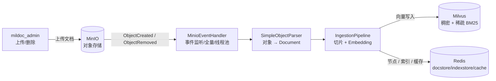
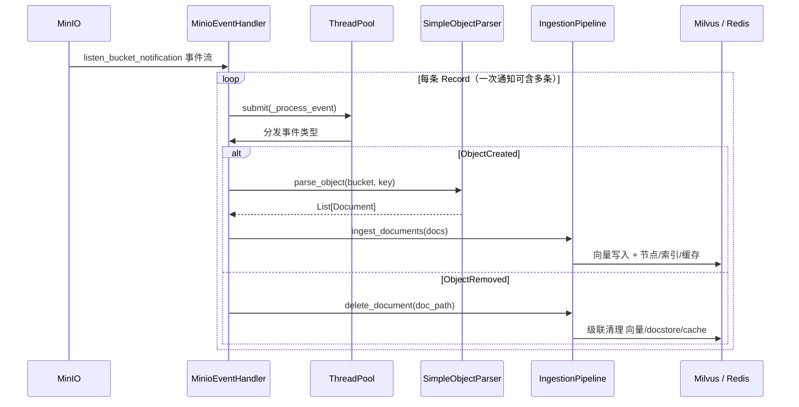

# mildoc_index · 文档摄取管线

负责把对象存储中的文档解析、切片、向量化并写入 Milvus 与 Redis（docstore / index store / ingestion cache），是 RAG 系统的「知识库构建」一侧。消费 MinIO 事件实现增量索引，也支持全量刷新。

## 运行模式

通过 `main.py --mode` 选择：

| 模式 | 说明 |
|---|---|
| `full-refresh` | 全量刷新：遍历桶内所有对象并行解析入库，全部完成后统一 `flush_collection`（触发 seal + 建索引） |
| `listen` | 增量更新：常驻监听 MinIO 事件（`ObjectCreated` / `ObjectRemoved`），实时同步 |
| `backfill` | 常量已预留，当前未在 `main.py` 中接入（落入使用说明分支），可按需实现「排查补漏」 |

> `--provider oss/minio` 参数存在，但当前版本仅 `minio` 真正实现（oss 分支为占位）。

## 技术架构



- 摄取管道按 `NODE_PARSER_MODE` 工厂选择：`hierarchical` → `HierarchicalDocumentIngestionPipeline`（层次节点解析）；默认 → `DocumentIngestionPipeline`（原逻辑）。
- 事件处理使用独立 `ThreadPoolExecutor`（默认取 CPU 核数，可用 `MINIO_PROCESS_MAX_WORKERS` 覆盖），接收与处理解耦，避免阻塞事件拉取。

## 执行流程（listen 模式）



- 目录对象（`application/x-directory`）自动跳过。
- 删除走 `delete_document` 的**级联清理**：不仅删 Milvus 向量，还清理 docstore / index store / ingestion cache 中对应数据，避免孤儿节点。

## 关键模块

| 文件 | 职责 |
|---|---|
| `main.py` | 命令行入口，按 `--mode` 分发 `full_update` / `start_listening` |
| `minio_event_handler.py` | `MinioEventHandler`：客户端、解析器、摄取管道、MilvusApi 初始化；事件提取 / 分发 / 线程池并发 |
| `parse/simple_object_parser.py` | `SimpleObjectParser`：把 MinIO 对象解析为 LlamaIndex `Document` |
| `ingestion/base_ingestion.py` | 摄取基类：存储初始化、`_setup_models`（`embed_batch_size=10`，对齐百炼上限）、`ingest_documents` / `delete_document`、重传保护 |
| `ingestion/ingestion_pipeline.py` `hierarchical_ingestion.py` | default / hierarchical 两种 `IngestionPipeline` |
| `milvus/milvus_api.py` | `MilvusApi`：集合创建、索引管理、`flush_collection` |

## 运行

```bash
cd mildoc_index
pip install -r requirements.txt
# 全量刷新
python main.py --provider minio --mode full-refresh
# 增量监听（建议 nohup 后台常驻）
python main.py --provider minio --mode listen
```

配置见 `.env`：`MINIO_*`、`MILVUS_*`、`NODE_PARSER_MODE`、`MILVUS_INDEX_TYPE/NLIST/METRIC_TYPE/NPROBE`（建索引类参数改后需删集合重摄取）、`MINIO_PROCESS_MAX_WORKERS`。
