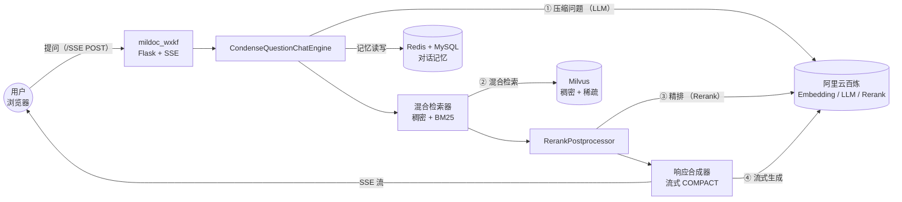
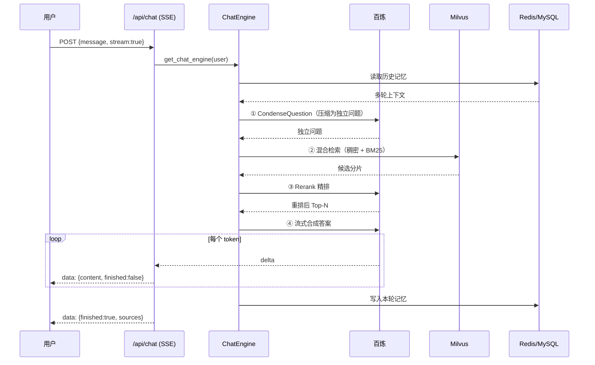

# mildoc_wxkf · 问答服务（面向客户）

基于 Flask 的 RAG 问答服务，接收用户问题后做「混合检索 + Rerank 精排 + LLM 流式生成」，通过 SSE 返回带引用来源的答案。支持多轮对话记忆，是系统中面向终端用户的一侧。

## 技术架构



- 检索侧按 `RETRIEVER_MODE` 选择：`hierarchical` → `HierarchicalRetrievalPipeline`（在混合检索上套 `AutoMergingRetriever`）；默认 → `DefaultRetrievalPipeline`（稠密 + BM25 混合）。
- 重排复用 `RerankService`（`core/rerank.py`），支持百炼 Rerank，失败则词法兜底。

## 一次问答的执行流程（SSE）



- 流式：路由层 `generate()` 逐个 token 以 `data: {...}` 帧推给前端，`finished:true` 时附带按 `file_path` 去重的引用来源。
- 非流式：`engine.chat()` 同步返回完整答案 + 来源（JSON）。
- 记忆由 `ChatEngine` 通过 `MemoryServiceMemory` 自动读写 `MemoryService`（Redis 短期 + MySQL 长期），路由层无需手动保存。

## 关键模块

| 文件 | 职责 |
|---|---|
| `app.py` | `create_app` 工厂：注册 `auth_bp` / `chat_bp`、初始化 SQLAlchemy、`/health`；运行关闭 reloader（避免 SSE 长连接被重载掐断） |
| `auth/routes.py` | 登录 / 登出 / `login_required` |
| `chat/routes.py` | `/chat` 页面 + `/api/chat` 流式问答接口（SSE） |
| `core/base_retriever.py` | `BaseRetrievalPipeline`：模型初始化、混合检索、Rerank 后处理器、响应合成器、查询引擎单例 |
| `core/default_retriever.py` `hierarchical_retriever.py` | default / hierarchical 两种检索管线 |
| `core/rerank.py` | `RerankService` 重排（百炼 / 词法兜底） |
| `memory/service.py` `llama_memory.py` | 对话记忆（Redis + MySQL）与 LlamaIndex 记忆适配 |

## 运行

```bash
cd mildoc_wxkf
pip install -r requirements.txt
python app.py
```

> ⚠️ 必须 `use_reloader=False`（已在 `app.py` 中设置）：reloader 会监视文件变动重启进程，掐断正在进行的 SSE 流，导致前端 `[网络错误] Failed to fetch`。

配置见 `.env`：`FLASK_*`、`MILVUS_*`、`REDIS_*`、`LLM_*`、`LLM_EMBEDDING_*`、`RERANK_*`、`RETRIEVER_MODE`、`TOP_K` / `TOP_N` 等。
